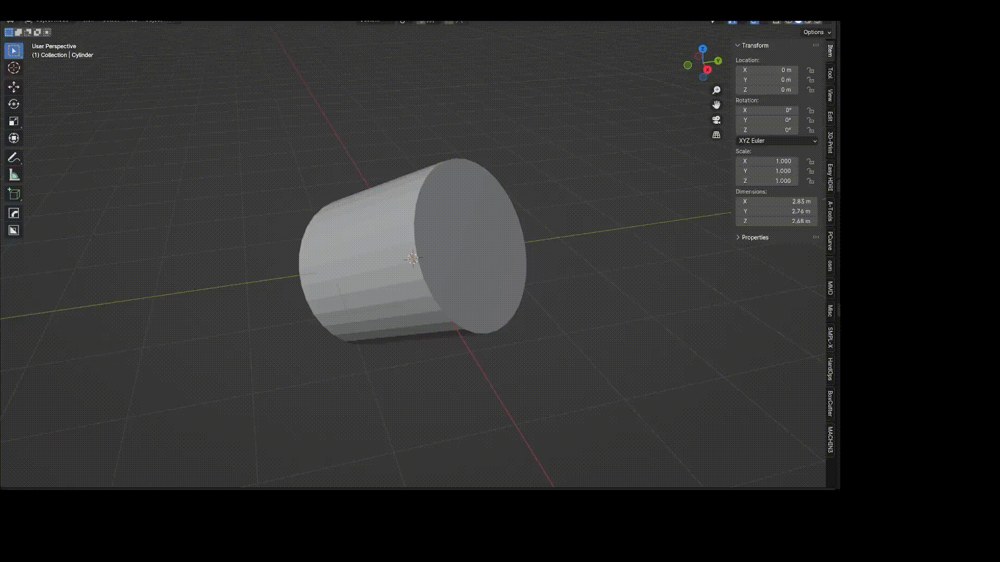

# Straighten Objects Addon for Blender

A tool to realign tilted meshes with applied rotation.

## Installation

1. Go to `Edit` > `Preferences` > `Add-ons`.
1. Click `Install...`.
1. Navigate to the select `straighten_objects.py`.
1. Enable the addon.

## Usage

1. Go to `Tool` tab in Sidebar.
1. Find the **Custom Transform Orientation** panel.
1. Select the tilted Edge or Face of the mesh in Edit Mode.
1. Press the **Straighten Object** button.

